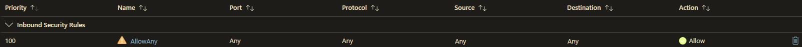
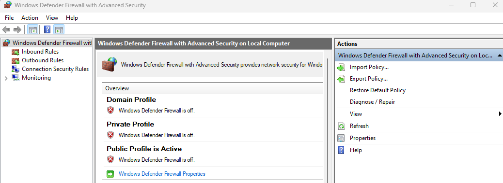
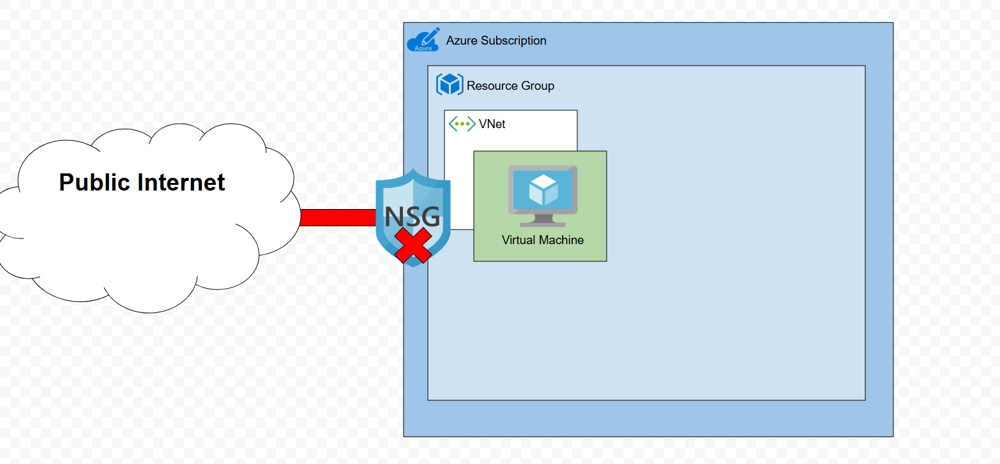
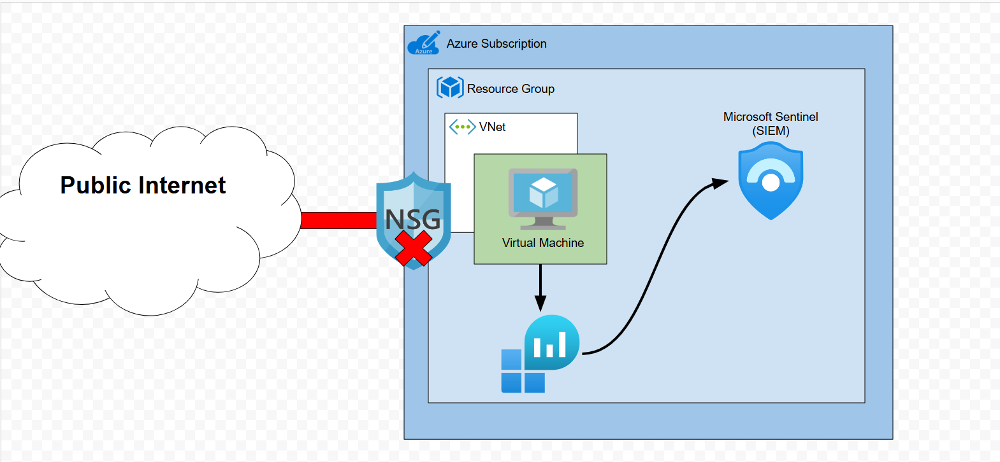
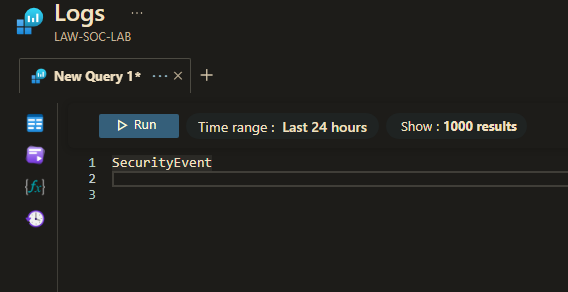
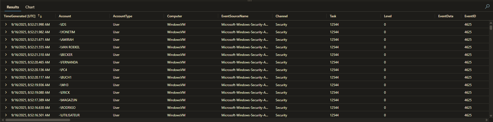
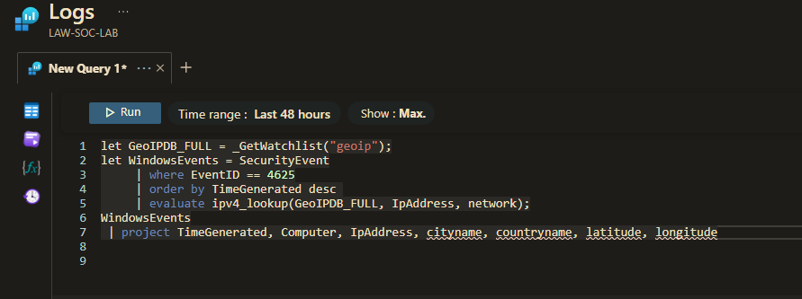
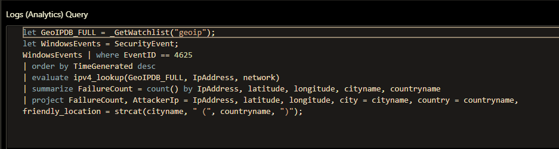
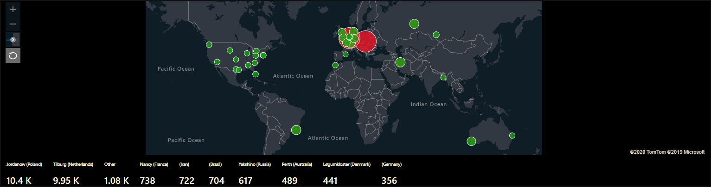

# Azure Honeypot + Attack Map Project

## Summary

I designed and deployed a honeypot in Microsoft Azure to capture and analyze malicious login attmeps. Using a Windows 11 virtual machine with permissive NSG(Network Securtiy Group) rules, I intentionally exposed the system to brute force traffic. Using the AMA(Azure Monitoring Agent) data collection rule, Windows Event Viewer logs were collected and forwareded to a centralized Log Analytics Workspace and connected to Azure Sentinel(Microsoft Defender).

To enhance visibility, I imported a GeoIp watchlist into Sentinel to enrich attacker IP addresses with geographic data. Using KQL queries, I correlated login attempts to their originating regions and built an interactive attack map workbook. I then used this workbook to visualize threat activity in real time.

Skill demonstrated: Cloud security monitoring, log management, SIEM configuration, KQL querying, incidient analysis, and Azure security services.

### Part 1 - Create Honeypot via Azure Virutal Machine

- Deployed a Windows 11 virtual machine.
- Configured Network Security Group(NSG) rule that allows any inbound traffic from destination any ip.
  
- Connected to the VM via Remote Desktop Protocol(RDP) and disabled the Windows firewall across domain, private, and public profiles.
  
- Configuring the Network Security Group to allow all traffic and disabling the Windows virtual machine is intentional for honeypot purposes.
- The overall lab diagram would look something like this:
  

### Part 2 - Log Forwarding to Microsoft Sentinel(Microsoft Defender)

- Created a Log Analytics Workspace.
- Deployed a Sentinel instance and connect it to the Log Analytics workspace that was just created.
- Created and configured the Windows Security Events via AMA connector.
- Created a DCR(Data Collection Rule) within sentinel.
- If everything is configured correctly our overall lab diagram should look like this.

  

- To check if the pipeline is working, I queried for logs in the Logs Analytics Workspace using this query.
  

### Part 3 - Log Enrichment and Finiding Location Data

- The logs that are available in the Log Analytics Workspace do not contain location data, only IP address. We can use the IP address to derive the location data.
  
- Imported a GeoIP csv file as a Sentinel Watchlist to map IP addresses to physical locations.
- Used a KQL query to correlate failed login attempts(Event ID 4625) with attacker locations.

  

### Part 4 - Create Attack Map

- Built a custom Sentinel Workbook to visualize failed login attempts on a geographic attack map. I used this KQL query as my data source.

  

- After leaving my WindowsVM on overnight, over 25K+ failed login attempts were recorded. This is what the map looked like.

  

- From the visualization above we can see that the most attacks originated from Jordanow, Poland.
- This is the final lab diagram of what we built during this project.

  
